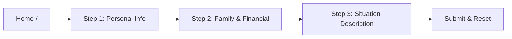

# Social Support App

## Overview

A modern, accessible multi-step form wizard for government social support applications. Citizens can apply for financial assistance with the help of AI-powered writing suggestions. Built with React 19, TypeScript, Redux Toolkit, and OpenAI GPT-3.5 integration.

### Key Features

- 🚀 **Multi-step Form Wizard** - Three-step progressive form with validation
- 🤖 **AI Writing Assistant** - OpenAI GPT-3.5 integration for content suggestions
- 🌐 **Multilingual Support** - English and Arabic with RTL support
- 💾 **Persistent State** - Form data survives page refreshes via Redux Persist
- ♿ **Accessible Design** - WCAG compliant with keyboard navigation
- 📱 **Responsive UI** - Mobile-first design with MUI and Tailwind CSS
- ✅ **Real-time Validation** - Zod schemas with React Hook Form
- 🎨 **Modern Stack** - React 19, TypeScript, Vite for optimal DX

## Tech Stack

| Category | Technologies |
|----------|-------------|
| **Frontend Framework** | React 19 + TypeScript 5.8 |
| **Build Tool** | Vite 7.1 |
| **State Management** | Redux Toolkit + Redux Persist |
| **Routing** | React Router 7.9 |
| **Forms** | React Hook Form + Zod |
| **UI Libraries** | MUI 5 + Tailwind CSS 4 |
| **Internationalization** | i18next + react-i18next |
| **API Client** | Axios |
| **AI Integration** | OpenAI GPT-3.5 |
| **Testing** | Jest + React Testing Library |
| **Code Quality** | Biome formatter |

## Architecture

### Design Patterns

- **Component-Based Architecture** - Modular React components with clear separation of concerns
- **Redux State Pattern** - Centralized state management with Redux Toolkit slices
- **API Factory Pattern** - Reusable Axios client with interceptors for error handling
- **Form Validation Pattern** - Zod schemas integrated with React Hook Form
- **Error Boundary Pattern** - Graceful error handling with fallback UI
- **Persistent State Pattern** - Redux Persist for localStorage integration

### Project Structure

```
src/
├── components/         # Shared UI components
│   ├── ErrorBoundary.tsx    # Global error handling
│   ├── Header.tsx           # App header with language switcher
│   ├── Layout.tsx           # Main layout wrapper
│   └── CompletionStats.tsx  # Form completion tracker
├── constants/          # App constants
│   └── routes.ts            # Route definitions
├── i18n/               # Internationalization
│   ├── config.ts            # i18next configuration
│   └── locales/
│       ├── en/translation.json  # English translations
│       └── ar/translation.json  # Arabic translations
├── lib/                # Utility libraries
│   ├── apiFactory.ts        # Axios instance factory
│   └── schema/              # Shared schemas
├── pages/              # Page components (form steps)
│   ├── PersonalInfo.tsx          # Step 1: Personal details
│   ├── FamilyFinancialInfo.tsx   # Step 2: Family & financial
│   ├── SituationDescription.tsx  # Step 3: Situation with AI
│   └── ErrorPages/               # Error page components
├── router/             # Routing configuration
│   └── AppRouter.tsx        # Main router component
├── services/           # External services
│   └── openaiService.ts     # OpenAI API integration
├── store/              # Redux store
│   ├── store.ts             # Store configuration
│   └── slices/              # Redux slices
├── utils/              # Utility functions
│   └── errorHandler.ts      # Error handling utilities
└── validation/         # Form validation
    └── schemas.ts           # Zod validation schemas
```

### Application Flow



For detailed flow diagrams, see [docs/flow-diagram.md](./docs/flow-diagram.md).

## Getting Started

### Prerequisites

- Node.js 18+
- pnpm 8+ (recommended) or npm/yarn
- OpenAI API key for AI features

### Installation

1. Clone the repository:
```bash
git clone https://github.com/yourusername/social-support-app.git
cd social-support-app
```

2. Install dependencies:
```bash
pnpm install
```

3. Configure environment variables:
```bash
# Create .env file in project root
echo 'VITE_OPENAI_API_KEY="your-openai-api-key"' > .env
```

4. Start the development server:
```bash
pnpm dev
```

The app will be available at `http://localhost:3000`.

## Usage

### Form Steps

1. **Step 1: Personal Information**
   - Full name, National ID
   - Date of birth, Phone number
   - Address details

2. **Step 2: Family & Financial Information**
   - Marital status, Number of dependents
   - Monthly income and expenses
   - Employment status

3. **Step 3: Situation Description**
   - Current situation narrative
   - Reason for assistance request
   - AI-powered writing suggestions

### Features Guide

- **Language Switching**: Use the language selector in the header to switch between English and Arabic
- **Progress Tracking**: Visual stepper shows current step and progress
- **AI Assistant**: Click "Help Me Write" in Step 3 for AI-generated content suggestions
- **Form Persistence**: Your data is automatically saved and restored on page refresh
- **Validation**: Real-time field validation with helpful error messages

## Development

### Commands

| Command | Description |
|---------|-------------|
| `pnpm dev` | Start dev server on port 3000 |
| `pnpm build` | Build for production |
| `pnpm preview` | Preview production build |
| `pnpm test` | Run all tests |
| `pnpm test:watch` | Run tests in watch mode |
| `pnpm test:coverage` | Generate coverage report |
| `pnpm format` | Format code with Biome |

### Code Style

- **Formatter**: Biome with tab indentation and double quotes
- **TypeScript**: Strict mode enabled
- **Imports**: Use `@/` alias for src directory
- **Components**: Functional components with TypeScript

### Testing

The project uses Jest and React Testing Library for testing:

- Tests are located alongside components (e.g., `ComponentName.test.tsx`)
- Current coverage: ~57% overall
- Key areas with high coverage:
  - FamilyFinancialInfo: 100%
  - PersonalInfo: 95.45%
  - OpenAI Service: 100%

View coverage report: `pnpm test:coverage` then open `coverage/lcov-report/index.html`

## API Documentation

### OpenAI Integration

The app integrates with OpenAI's GPT-3.5 model for AI-powered writing assistance:

```typescript
// src/services/openaiService.ts
getOpenAISuggestion(apiKey: string, prompt: string): Promise<string>
```

- **Model**: GPT-3.5-turbo
- **Temperature**: 0.7 (balanced creativity)
- **Max Tokens**: 300 (concise responses)
- **Error Handling**: Custom ApiError class with status codes

## Performance

- **Bundle Size**: Optimized with Vite's tree-shaking
- **Code Splitting**: Route-based splitting for optimal loading
- **State Persistence**: Redux Persist with localStorage
- **Lazy Loading**: Components loaded on demand

## Security

- **API Keys**: Stored in environment variables
- **Input Validation**: Zod schemas on all forms
- **XSS Protection**: React's built-in escaping
- **Error Boundaries**: Graceful error handling

## Browser Support

- Chrome/Edge 90+
- Firefox 88+
- Safari 14+
- Mobile browsers (iOS Safari, Chrome Android)

## Contributing

1. Fork the repository
2. Create a feature branch (`git checkout -b feature/amazing-feature`)
3. Commit your changes (`git commit -m 'Add amazing feature'`)
4. Run tests (`pnpm test`)
5. Format code (`pnpm format`)
6. Push to the branch (`git push origin feature/amazing-feature`)
7. Open a Pull Request

### Commit Guidelines

- Run tests before committing: `pnpm test`
- Format code: `pnpm format`
- Add translations to both `en/translation.json` and `ar/translation.json`
- Follow existing patterns for new components

## License

MIT

## Support

For issues, questions, or suggestions, please open an issue on GitHub.