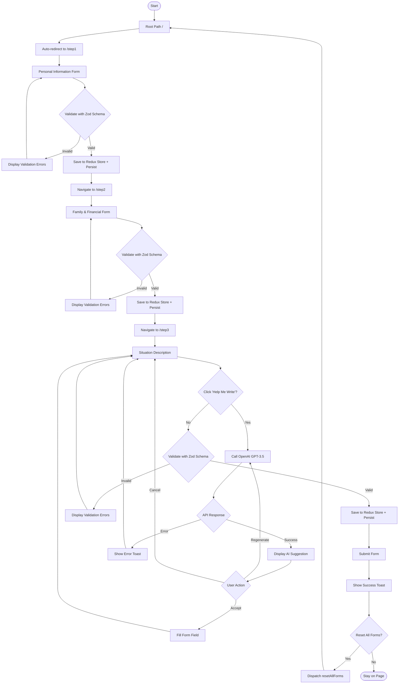
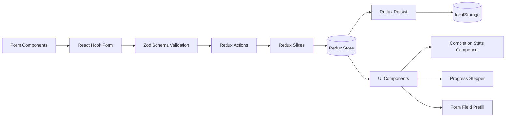
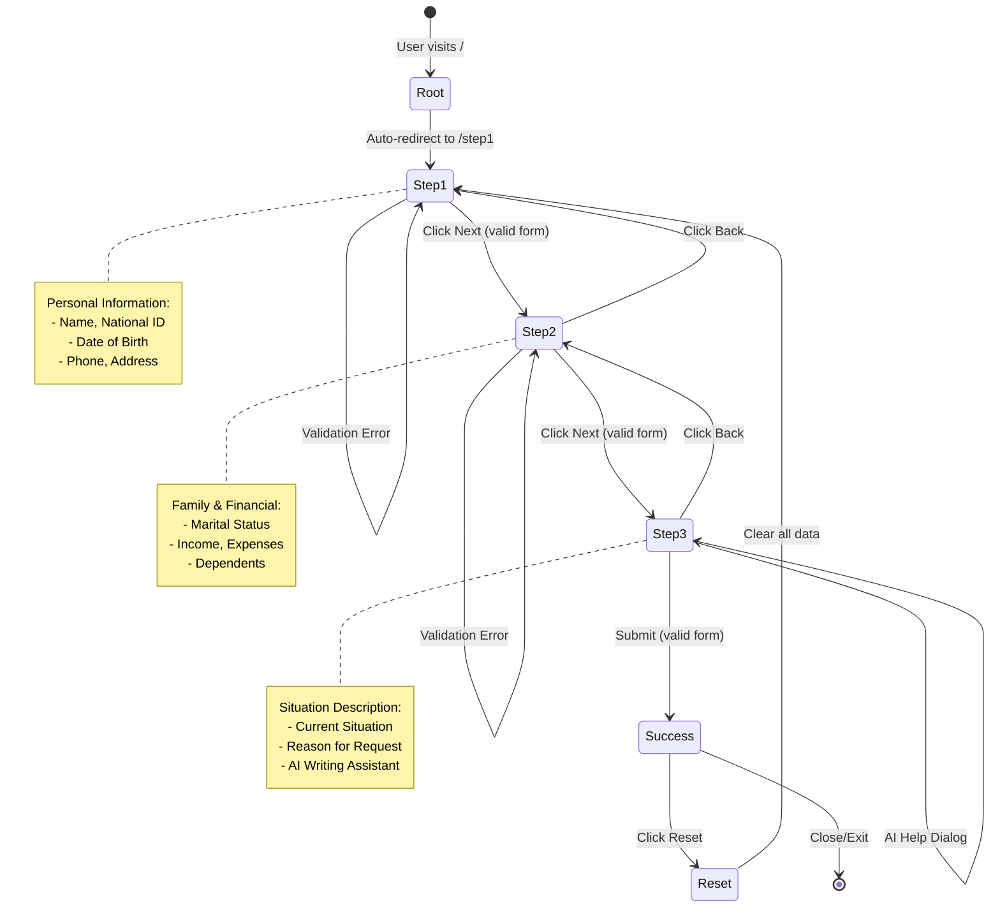
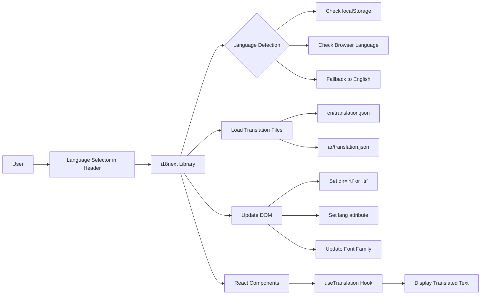

# Social Support App Flow Diagram

## Application Flow



## Data Flow



## Component Architecture

```mermaid
graph TD
    Root[main.tsx] --> StrictMode[React.StrictMode]
    StrictMode --> ErrorBoundary[ErrorBoundary Component]
    ErrorBoundary --> Provider[Redux Provider]
    Provider --> PersistGate[Redux PersistGate]
    PersistGate --> BrowserRouter[React Router BrowserRouter]
    BrowserRouter --> App[App Component]

    App --> Toaster[Sonner Toaster]
    App --> Layout[Layout Component]

    Layout --> Header[Header Component]
    Header --> LanguageSwitcher[Language Switcher]
    Header --> ThemeToggle[Theme Toggle]

    Layout --> MuiTheme[MUI ThemeProvider]
    MuiTheme --> Stepper[MUI Stepper - 3 Steps]
    MuiTheme --> Container[MUI Container]
    Container --> AppRouter[AppRouter Component]

    AppRouter --> Routes{React Router Routes}
    Routes --> Step1[/step1: PersonalInfo]
    Routes --> Step2[/step2: FamilyFinancialInfo]
    Routes --> Step3[/step3: SituationDescription]
    Routes --> ErrorPages[Error Pages]

    ErrorPages --> NotFound[404 NotFound]
    ErrorPages --> Unauthorized[401 Unauthorized]
    ErrorPages --> Forbidden[403 Forbidden]
    ErrorPages --> ServerError[500 ServerError]

    Step1 --> PersonalForm[React Hook Form + Zod]
    Step2 --> FamilyForm[React Hook Form + Zod]
    Step3 --> SituationForm[React Hook Form + Zod + AI]

    SituationForm --> OpenAIService[OpenAI Service]
    OpenAIService --> APIFactory[API Factory with Axios]
```

## Navigation Flow




## Internationalization (i18n) Flow


