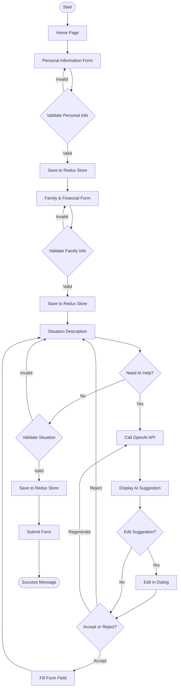
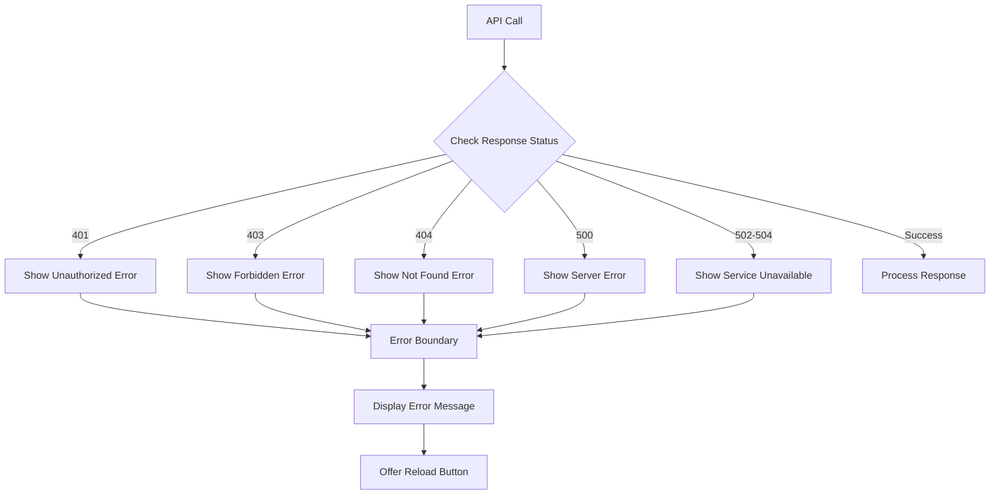
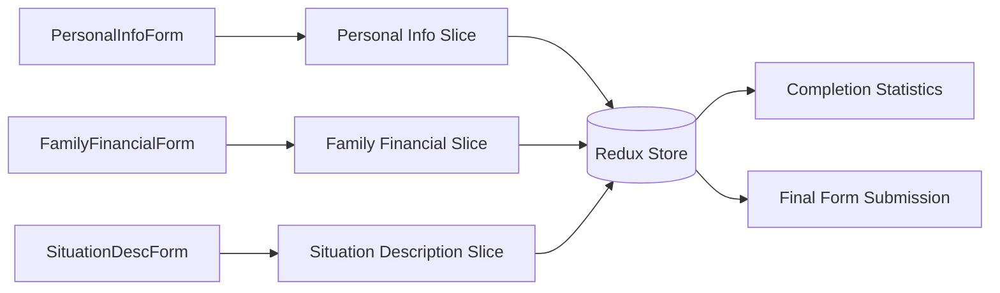
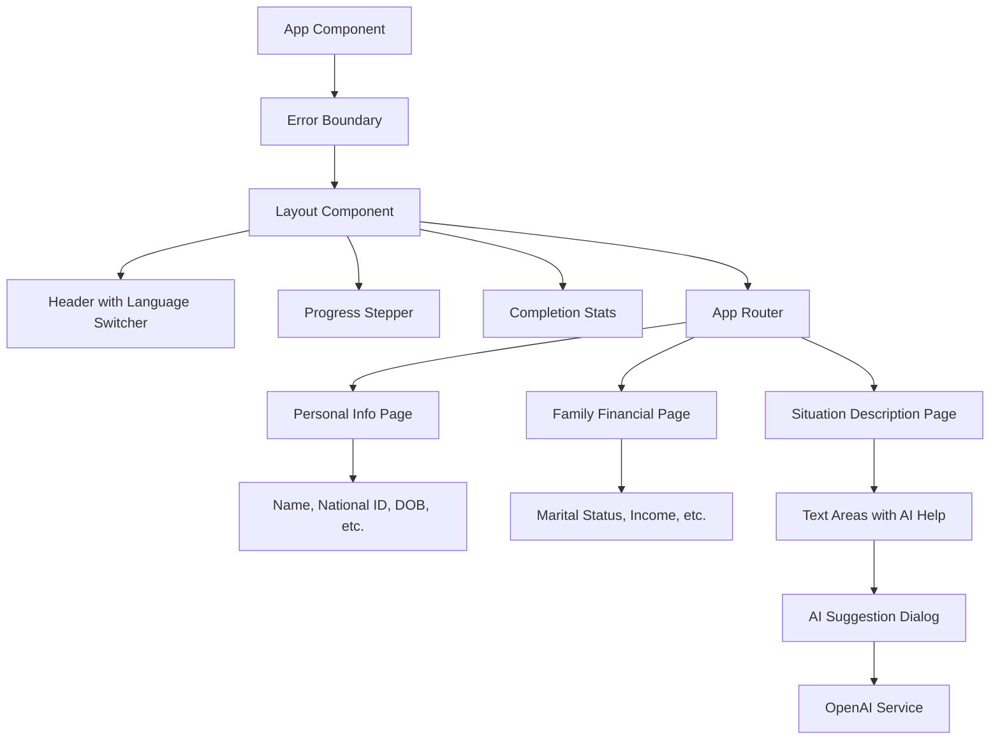
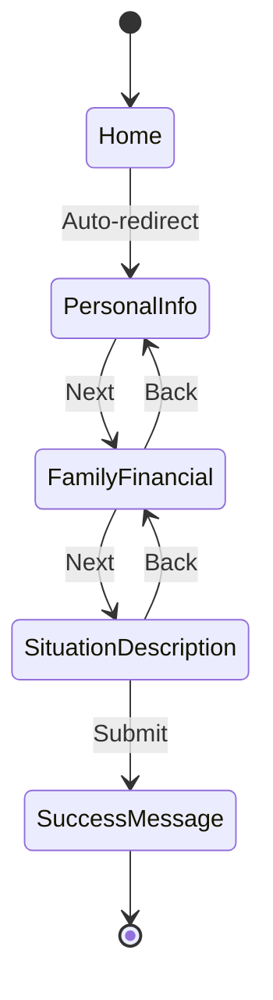

# Social Support App Flow Diagram

## Application Flow

```mermaid
graph TD
    Start([Start]) --> HomePage[Home Page]
    HomePage --> PersonalInfo[Personal Information Form]

    PersonalInfo --> ValidatePersonal{Validate Personal Info}
    ValidatePersonal -->|Invalid| PersonalInfo
    ValidatePersonal -->|Valid| SavePersonal[Save to Redux Store]
    SavePersonal --> FamilyFinancial[Family & Financial Form]

    FamilyFinancial --> ValidateFamily{Validate Family Info}
    ValidateFamily -->|Invalid| FamilyFinancial
    ValidateFamily -->|Valid| SaveFamily[Save to Redux Store]
    SaveFamily --> SituationDesc[Situation Description]

    SituationDesc --> AIHelp{Need AI Help?}
    AIHelp -->|Yes| OpenAIAPI[Call OpenAI API]
    OpenAIAPI --> DisplaySuggestion[Display AI Suggestion]
    DisplaySuggestion --> EditSuggestion{Edit Suggestion?}
    EditSuggestion -->|Yes| EditDialog[Edit in Dialog]
    EditDialog --> AcceptReject{Accept or Reject?}
    EditSuggestion -->|No| AcceptReject
    AcceptReject -->|Accept| FillField[Fill Form Field]
    AcceptReject -->|Reject| SituationDesc
    AcceptReject -->|Regenerate| OpenAIAPI
    FillField --> SituationDesc

    AIHelp -->|No| ValidateSituation{Validate Situation}
    ValidateSituation -->|Invalid| SituationDesc
    ValidateSituation -->|Valid| SaveSituation[Save to Redux Store]
    SaveSituation --> SubmitForm[Submit Form]
    SubmitForm --> Success([Success Message])
```

## Error Handling Flow

```mermaid
graph TD
    APICall[API Call] --> CheckStatus{Check Response Status}
    CheckStatus -->|401| Unauthorized[Show Unauthorized Error]
    CheckStatus -->|403| Forbidden[Show Forbidden Error]
    CheckStatus -->|404| NotFound[Show Not Found Error]
    CheckStatus -->|500| ServerError[Show Server Error]
    CheckStatus -->|502-504| ServiceUnavailable[Show Service Unavailable]
    CheckStatus -->|Success| ProcessResponse[Process Response]

    Unauthorized --> ErrorBoundary[Error Boundary]
    Forbidden --> ErrorBoundary
    NotFound --> ErrorBoundary
    ServerError --> ErrorBoundary
    ServiceUnavailable --> ErrorBoundary

    ErrorBoundary --> DisplayError[Display Error Message]
    DisplayError --> ReloadOption[Offer Reload Button]
```

## Data Flow

```mermaid
graph LR
    PersonalInfoForm --> PersonalInfoSlice[Personal Info Slice]
    FamilyFinancialForm --> FamilyFinancialSlice[Family Financial Slice]
    SituationDescForm --> SituationDescSlice[Situation Description Slice]

    PersonalInfoSlice --> ReduxStore[(Redux Store)]
    FamilyFinancialSlice --> ReduxStore
    SituationDescSlice --> ReduxStore

    ReduxStore --> CompletionStats[Completion Statistics]
    ReduxStore --> FormSubmission[Final Form Submission]
```

## Component Architecture

```mermaid
graph TD
    App[App Component] --> ErrorBoundary[Error Boundary]
    ErrorBoundary --> Layout[Layout Component]
    Layout --> Header[Header with Language Switcher]
    Layout --> Stepper[Progress Stepper]
    Layout --> CompletionStats[Completion Stats]
    Layout --> AppRouter[App Router]

    AppRouter --> PersonalInfo[Personal Info Page]
    AppRouter --> FamilyFinancial[Family Financial Page]
    AppRouter --> SituationDesc[Situation Description Page]

    PersonalInfo --> FormFields1[Name, National ID, DOB, etc.]
    FamilyFinancial --> FormFields2[Marital Status, Income, etc.]
    SituationDesc --> FormFields3[Text Areas with AI Help]

    FormFields3 --> AIDialog[AI Suggestion Dialog]
    AIDialog --> OpenAIService[OpenAI Service]
```

## Navigation Flow

```mermaid
stateDiagram-v2
    [*] --> Home
    Home --> PersonalInfo: Auto-redirect
    PersonalInfo --> FamilyFinancial: Next
    FamilyFinancial --> PersonalInfo: Back
    FamilyFinancial --> SituationDescription: Next
    SituationDescription --> FamilyFinancial: Back
    SituationDescription --> SuccessMessage: Submit
    SuccessMessage --> [*]
```